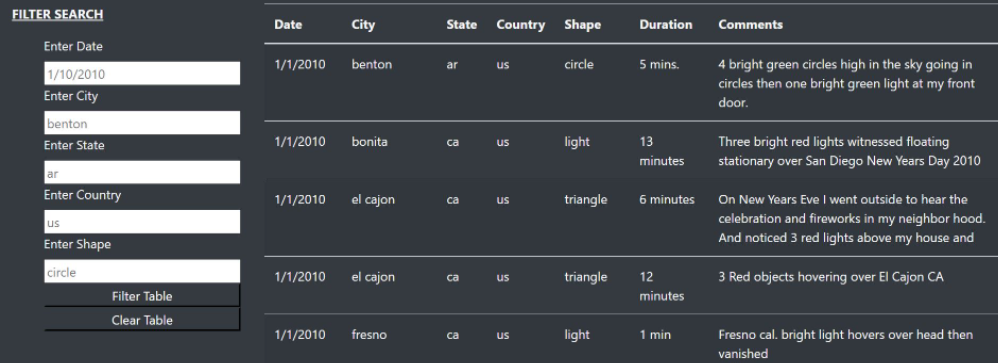
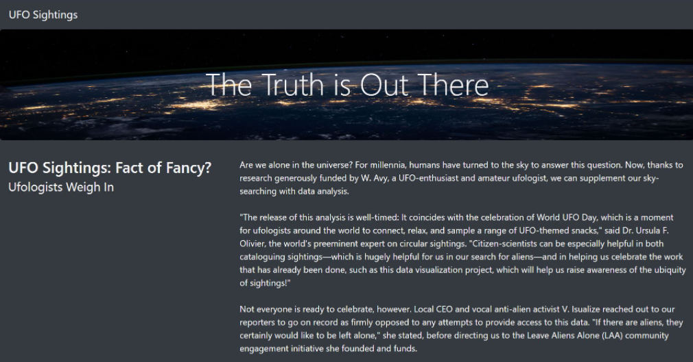
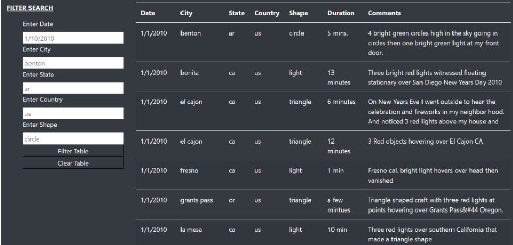
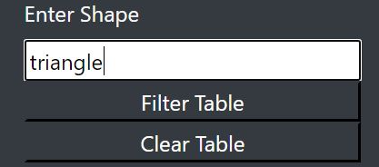
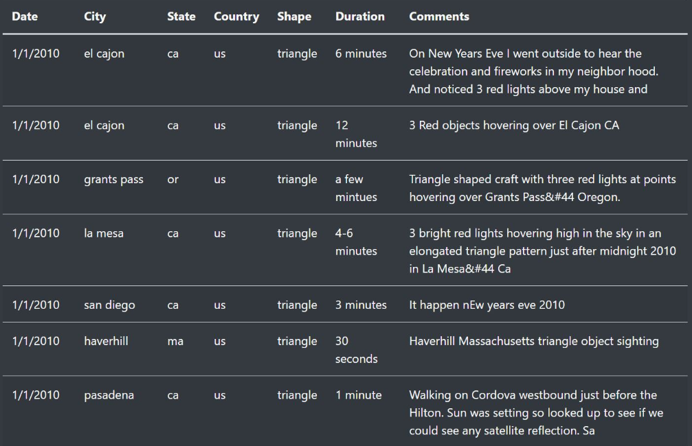
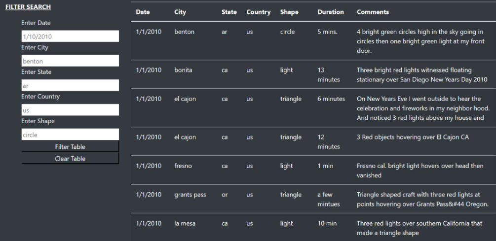

# JavaScript, Bootstrap, and UFOs

## Overview of Project
> Dana’s webpage and dynamic table are working as intended, but she’d like to provide a more in-depth analysis of UFO sightings by allowing users to filter for multiple criteria at the same time. In addition to the date, you’ll add table filters for the city, state, country, and shape. 

## A written report on the UFO analysis

1. **Overview of Project:** Explain the purpose of this analysis. 
2. **Results:** Describe to Dana how someone might use the new webpage by walking her through the process of using the search criteria. Use images of your webpage during the filtering process to support your explanation.
3. **​Summary:** In a summary statement, describe one drawback of this new design and two recommendations for further development.

1. **Overview of Project:** Our UFOs Project has a single mission, which is to enhance our webpage with the capability to add filters with multiple factors.
D3 functionality makes an instance listener for multiple changes in our search, displaying needed datasets on the result table.

> Image with `JavaScript` & `HTML` Code below.

**Code and Image**

````java
// EXTRA: Create a variable to keep track of all the filters as an object.
var clearEntries = d3.select("#clear-btn");
clearEntries.on("click", function() {
  location.reload();
});


// 1. Create a variable to keep track of all the filters as an object.
var filters = {
};

// 3. Use this function to update the filters. 
function updateFilters() {

    // 4a. Save the element that was changed as a variable.
    let inputElement = d3.select(this);

    // 4b. Save the value that was changed as a variable.
    let inputValue = inputElement.property("value");

    // 4c. Save the id of the filter that was changed as a variable.
    let inputID = inputElement.attr("id");
  
    // 5. If a filter value was entered then add that filterId and value
    // to the filters list. Otherwise, clear that filter from the filters object.

      if (inputValue) {
        filters[inputID] = inputValue;
    } else{filters ={};};
  
  
    // 6. Call function to apply all filters and rebuild the table
    filterTable(filters);
};

// 7. Use this function to filter the table when data is entered.
function filterTable(obj) {
  
    // 8. Set the filtered data to the tableData.
    let filteredData = tableData;
  
    // 9. Loop through all of the filters and keep any data that
    // matches the filter values
    Object.entries(obj).forEach(([fkey, fval]) =>{
        
      filteredData = filteredData.filter((row) => row[fkey] === fval)
          

  });
  
    // 10. Finally, rebuild the table using the filtered data
    buildTable(filteredData);
};
  
  // 2. Attach an event to listen for changes to each filter
  d3.selectAll("input").on("change",updateFilters);
  
  // Build the table when the page loads
  buildTable(tableData);
````




2. **Results:** Let’s describe step by step how someone might use the new webpage by walking through the process of using the search criteria. Using images of your webpage during the filtering process to support your explanation.
 
Let’s begin reviewing our HTML Filter and Table code. 

> Image with `JavaScript` & `HTML` Code below.

**Code and Image**


````html
    <!--Filter and Table-->
    <div class="container-fluid">
        <div class="row">
          <div class="col-md-3">
                <form class="bg-dark">
                    <p><b><u>FILTER SEARCH</u></b></p>
                    <ul class="bg-dark">

                        <!-- CHALLENGE NEED - Filter Using New <form> Tag-->
                        <li class="list-group" class="btn-dark">
                                <label for="datetime">Enter Date</label>
                                <input type="text" placeholder="1/10/2010" id="datetime" />
                        </li>

                        <li class="list-group" class="btn-dark">
                            <label for="city">Enter City</label>
                            <input type="text" placeholder="benton" id="city">
                        </li>

                        <li class="list-group" class="btn-dark">
                            <label for="state">Enter State</label>
                            <input type="text" placeholder="ar" id="state">
                        </li>

                        <li class="list-group" class="btn-dark">
                            <label for="country">Enter Country</label>
                            <input type="text" placeholder="us" id="country">
                        </li>

                        <li class="list-group" class="btn-dark">
                            <label for="shape">Enter Shape</label>
                            <input type="text" placeholder="circle" id="shape">
                        </li>
                        
                        <li class="list-group" class="btn-dark">
                            <button id="filter-btn" type="button" class="btn-dark">
                            Filter Table
                            </button>

                            <button id="clear-btn" type="button" class="btn-dark">
                            Clear Table
                            </button>

                        </li>

                    </ul>
                </form>
          </div>
````

From our Website (Project Example:) [`https://www.UFOs.gov`](https://cparnell1.github.io/UFOs/). 




Need to visit FILTER SEARCH 



On filter criteria, you can search by "Shape" only if want, example: triangle



And click on "Filter Table" button,


Automatically your search criteria will appear in our dynamic table resource.  



And, if want to start a new search, just click on "Clear Table" button, and start a new search.


After clear table, you may see our default data, 




3. ​**​Summary:** In a summary statement, describe one drawback of this new design and two recommendations for further development.


> Drawback:

During the project, we realized that we needed to publicly expose the information in order to do so it was necessary to use GitHub Pages to gather our information all in one place.

> Recommendations:


1. **GitHub Pages - Website Presentation**
Please use the following [`GitHub Pages`](https://pages.github.com/), for more information on how to use IO pages. 

2. **Create a better `HTML`, `CSS`, and `JavaScript` Work interaction that feed UFOs data from most concise and automate workload**

For our best data presentation and most concise introduction to UFO information, we highly recommend UFO summaries. These fact-filled summaries provide revealing UFO information from dozens of government, military, and intelligence witnesses with impeccable credentials, that involves M.D. and former ER director, Dr. Steven M. Greer, has compiled videotaped testimony of astronauts, generals, professors, and highly respected government officials who reveal their direct experiences in the UFO cover-up. 

Including live testimonies were transcribed and published in the highly revealing Data. 


